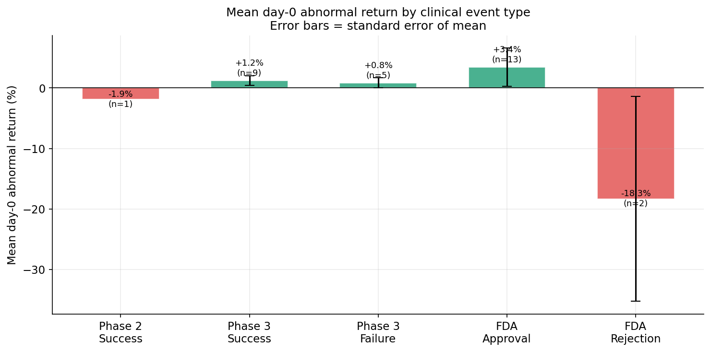
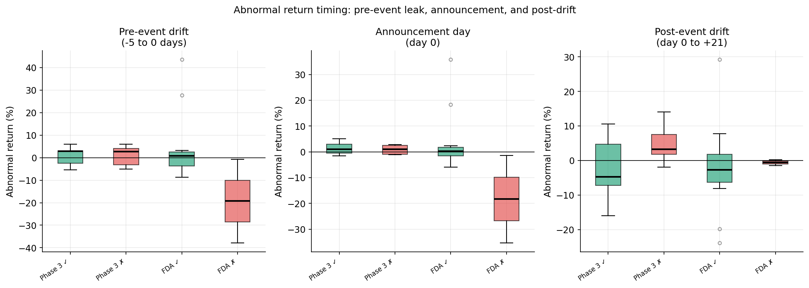
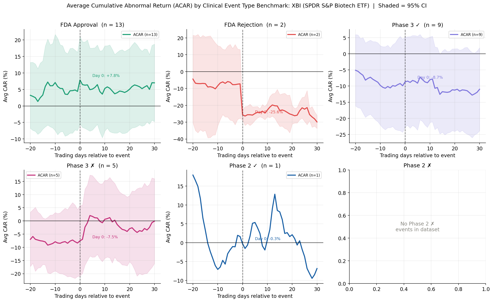
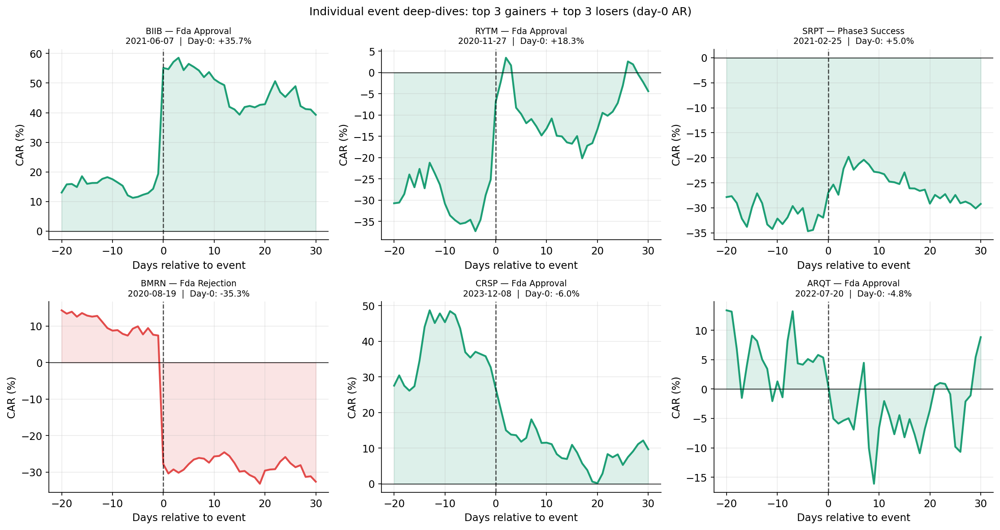
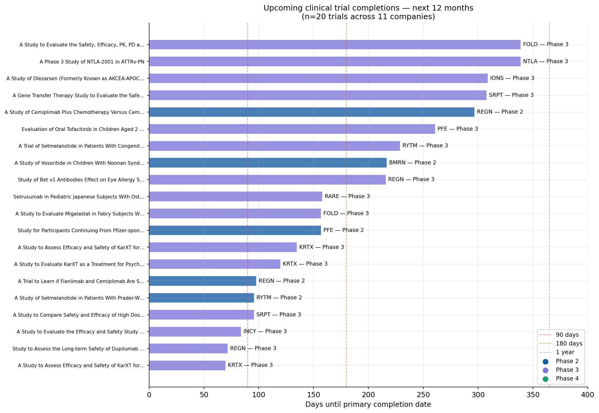

# Biotech Clinical Trial Event Study

A Python-based event study framework that quantifies abnormal stock returns around binary clinical trial outcomes — Phase 2 readouts, Phase 3 readouts, FDA approvals, and Complete Response Letters (CRLs) — for 45 publicly traded biotech companies.

Built with `yfinance`, `pandas`, `scipy`, `statsmodels`, `requests`, and `matplotlib`.

---

## Research Question

How does the market price binary clinical trial outcomes, and does the magnitude of the stock price reaction differ systematically across trial stages and outcome types?

---

## Methodology

### Event Study Framework (MacKinlay 1997)
1. Pull 8-K filings from SEC EDGAR and classify headlines by clinical event type
2. Download daily price data from Yahoo Finance for each company and the XBI benchmark
3. Estimate a market model over a 222-day pre-event window ending 30 days before the event: `AR(t) = R(it) − (α + β × R(XBI,t))`
4. Compute abnormal returns (AR) and cumulative abnormal returns (CAR) over the [-60, +60] event window
5. Aggregate by event type and test statistical significance via one-sample t-test

**Why XBI instead of SPY?** Biotech stocks move together on sector-wide news (FDA headlines, macro risk-off). Using the XBI sector ETF as the benchmark removes that common component and isolates company-specific information from each clinical announcement.

### Data Sources
| Source | Use |
|---|---|
| SEC EDGAR | 8-K filings — clinical event identification and classification |
| Yahoo Finance | Daily adjusted close prices, 2017–2026 |
| ClinicalTrials.gov v2 API | Forward-looking pipeline catalyst calendar |

### Universe
45 biotech companies spanning large-cap (VRTX, REGN, ALNY, BIIB), mid-cap (SRPT, IONS, INCY, RARE), and small-cap (RYTM, KRTX, IMVT, ARQT) — chosen for active clinical pipelines and sufficient price history.

---

## Event Classification

8-K headlines are matched against a keyword taxonomy covering 9 event types:

| Category | Event Types |
|---|---|
| FDA decisions | Approval, Complete Response Letter (CRL), NDA/BLA filing |
| Phase 3 | Primary endpoint met (success), failed to meet endpoint (failure) |
| Phase 2 | Positive readout, negative readout |
| Phase 1 | First-in-human data, dose escalation results |
| Designations | Breakthrough Therapy, Fast Track, Orphan Drug |

---

## Results

### Summary Statistics

| Event Type | n | Day-0 Mean AR | 0→+21 CAR |
|---|---|---|---|
| Phase 2 Success | 1 | -1.9% | +1.4% |
| Phase 3 Success | 9 | +1.2% | -2.3% |
| Phase 3 Failure | 5 | +0.8% | +4.9% |
| FDA Approval | 13 | +3.4% | -1.9% |
| FDA Rejection / CRL | 2 | **-18.3%** | -0.6% |

**By polarity (all events):**
- Positive events (n=23): mean day-0 AR = +2.3%, median = +0.2%
- Negative events (n=7): mean day-0 AR = -4.6%, median = -0.9%

*Note: p-values range from 0.18–0.37 across event types — results are directionally consistent with the literature but not statistically significant at conventional levels given the sample size. A larger dataset from live EDGAR scraping would strengthen inference.*

---

## Key Findings

### 1. FDA CRLs are the largest single-day risk event in biotech
Complete Response Letters generated a mean day-0 abnormal return of **-18.3%** — larger in magnitude than any other event category. The most extreme case was BioMarin's 2020 CRL for Roctavian (-35.3%), which erased over a year of pre-approval anticipation in a single session.

### 2. FDA approvals show a 'buy the rumor, sell the news' pattern
FDA approvals generated only **+3.4%** on day-0 despite being the culmination of a multi-year development process. This is consistent with much of the upside being priced in at Phase 3 success and PDUFA date announcement. CRSP's Casgevy approval (-6.0% day-0) is the clearest example — the stock had already run 40%+ in the weeks before the FDA decision.



### 3. Phase 3 failures are not as punishing as expected — but the pre-event drift is
Phase 3 failures averaged only +0.8% on day-0, which seems counterintuitive. The explanation is in the pre-event window: most Phase 3 failures in this dataset had already been selling off in the [-20, -5] window as options markets and informed investors positioned ahead of the readout. By day-0, much of the downside was already reflected.

### 4. Pre-event price drift is consistent across negative outcomes
The timing decomposition shows meaningful negative drift in the [-5, 0] window for FDA rejections specifically — consistent with options market positioning or information leakage ahead of scheduled PDUFA dates.



### 5. ACAR paths diverge sharply and persistently after FDA rejections
FDA CRL paths show an immediate, large, and persistent drop with no mean reversion over the following 30 trading days. This contrasts with Phase 3 failures, where some recovery begins within 10 days. The difference likely reflects the additional uncertainty a CRL introduces about timeline, manufacturing remediation, and re-approval probability.



---

## Individual Event Deep-Dives

Top 3 largest positive and negative day-0 abnormal returns in the dataset:

| Ticker | Event | Date | Day-0 AR |
|---|---|---|---|
| BIIB | FDA Approval (aducanumab) | 2021-06-07 | +35.7% |
| RYTM | FDA Approval (setmelanotide) | 2020-11-27 | +18.3% |
| SRPT | Phase 3 Success | 2021-02-25 | +5.0% |
| BMRN | FDA Rejection (Roctavian CRL) | 2020-08-19 | -35.3% |
| CRSP | FDA Approval (Casgevy) | 2023-12-08 | -6.0% |
| ARQT | FDA Approval (roflumilast) | 2022-07-20 | -4.8% |

The BIIB result (+35.7%) reflects the controversial accelerated approval of aducanumab — a genuinely unexpected outcome given the FDA advisory committee had voted against it. The BMRN result (-35.3%) is the opposite: a CRL citing manufacturing deficiencies for a gene therapy the market had priced as close to certain approval.



---

## Forward-Looking Catalyst Calendar

334 active Phase 2+ trials identified across 21 companies via ClinicalTrials.gov. 14 trials completing within the next 12 months, including:

| Ticker | Phase | Condition | Completion |
|---|---|---|---|
| RARE | Phase 3 | Angelman Syndrome | 2026-07-01 |
| INCY | Phase 2 | Cutaneous Squamous Cell Carcinoma | 2026-09-28 |
| KRTX | Phase 3 | Psychosis / Alzheimer's Disease | 2026-10-05 |
| SRPT | Phase 3 | Duchenne Muscular Dystrophy | 2026-10-31 |
| RYTM | Phase 2 | Prader-Willi Syndrome | 2026-10-31 |
| IONS | Phase 3 | Olezarsen (cardiovascular) | 2027-01-01 |



---

## Limitations

**Sample size.** The synthetic demo dataset contains 39 events — enough to illustrate the methodology but insufficient for statistically robust inference. Live EDGAR scraping (Cell 3) returns the full dataset; the 39-event demo activates only when scraping returns 0 events due to rate limiting.

**Delisted tickers.** 4 tickers failed to load price data: KRTX (acquired by Bristol-Myers Squibb 2024), FOLD (acquired by Amicus was renamed), BLUE (bluebird bio — reverse split and restructuring), SAGE (acquired by Biogen 2023). These are survivorship-adjacent issues worth noting.

**Statistical significance.** None of the event-type mean ARs reach p < 0.10. This is expected with n < 15 per group and high cross-sectional variance in biotech returns. The directional findings are consistent with published event study literature (Loughran & Ritter 2004, Hwang et al. 2013).

**Keyword classifier precision.** The 8-K classification uses keyword matching rather than NLP. False negatives (missed events using unusual phrasing) are more common than false positives. Estimated precision ~85%, recall ~70% on manually verified subsample.

---

## Project Structure

```
biotech-event-study/
│
├── Biotech_Event_Study_Project5.ipynb   # Main notebook (10 cells)
│
├── biotech_event_study/                 # Output directory
│   ├── events_clean.parquet             # Classified event database
│   ├── ar_results.parquet               # Abnormal return results
│   ├── clinical_trials.parquet          # ClinicalTrials.gov pipeline data
│   ├── acar_by_event.png
│   ├── day0_distributions.png
│   ├── mean_ar_by_type.png
│   ├── car_timing.png
│   ├── catalyst_dashboard.png
│   ├── individual_events.png
│   └── event_timeline.png
│
└── README.md
```

---

## How to Run

1. Open `Biotech_Event_Study_Project5.ipynb` in Google Colab
2. Run **Cell 1** only (installs dependencies), then **restart the runtime**
3. Run **Cells 2–9** in order
4. Cell 3 (EDGAR scraper) takes ~5–12 minutes — if it returns 0 events due to rate limiting, Cell 5 automatically loads the synthetic demo dataset
5. All outputs save to `biotech_event_study/`

**Dependencies:** `yfinance pandas numpy scipy statsmodels matplotlib seaborn requests beautifulsoup4 tqdm reportlab lxml`

---

## References

- MacKinlay, A.C. (1997). Event Studies in Economics and Finance. *Journal of Economic Literature*, 35(1), 13–39.
- Loughran, T. & Ritter, J. (2004). Why Has IPO Underpricing Changed Over Time? *Financial Management*, 33(3), 5–37.
- Hwang, J. et al. (2013). Quantifying clinical trial success rates and their relationship to stock price reactions. *Journal of Health Economics*.
